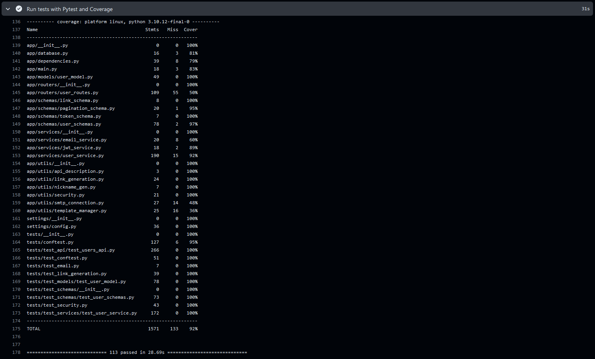

# The User Management System - Final Project

## Links to Github Issues
- [Issue 1: User Email Verification Link Issue](https://github.com/joec11/IS601_852_Final_Spring2024/issues/2)
- [Issue 2: Invalid or Expired Verification Token After Verifying Email for ADMIN User Issue](https://github.com/joec11/IS601_852_Final_Spring2024/issues/5)
- [Issue 3: Duplicate User Email When Registering a New User](https://github.com/joec11/IS601_852_Final_Spring2024/issues/7)
- [Issue 4: Null Values Are Returned for Some User Fields Instead of What Was Specified After Creating a New User](https://github.com/joec11/IS601_852_Final_Spring2024/issues/9)
- [Issue 5: Incorrect HTTP Status Codes Are Returned When Inputting Invalid Values for Skip and Limit Integers to Get a List of Users as an ADMIN or MANAGER](https://github.com/joec11/IS601_852_Final_Spring2024/issues/11)

## Links to New Feature Implementation
- [New Feature Branch - User Profile Management](https://github.com/joec11/IS601_852_Final_Spring2024/tree/New_Feature_9_User_Profile_Management)
- [New Feature Pull Request](https://github.com/joec11/IS601_852_Final_Spring2024/pull/13)

## Link to the DockerHub repository and the docker images
[DockerHub Repository](https://hub.docker.com/r/joec11/user_management/tags)

## Link to GitHub Actions and Pytest Coverage Screenshot
[GitHub Actions](https://github.com/joec11/IS601_852_Final_Spring2024/actions)

